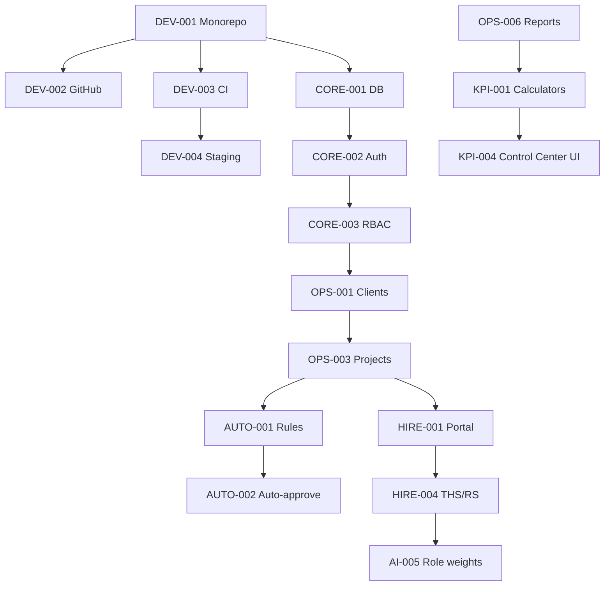

# LanceFlow — Story-Based Development Plan

Master plan: **62 user stories**, modular monorepo, **DevOps/GitHub workflow**, and **per-story development prompts** for team + AI agents.

**Index of all stories:** [../stories/README.md](../stories/README.md)

**Related docs**

| Doc | Purpose |
|-----|---------|
| [PLANNING_SUMMARY_AND_GUIDE.md](./PLANNING_SUMMARY_AND_GUIDE.md) | Product vision, formulas, CTO principles |
| [MODULAR_ARCHITECTURE.md](./MODULAR_ARCHITECTURE.md) | Package boundaries and extension points |
| [DEVOPS_AND_GITHUB_WORKFLOW.md](./DEVOPS_AND_GITHUB_WORKFLOW.md) | Branches, PR, CI/CD, client visibility |
| [PROJECT_STATUS.md](./PROJECT_STATUS.md) | **Client-facing** progress (update each release) |
| [DEVELOPMENT_PLAN.md](./DEVELOPMENT_PLAN.md) | Original phase overview (reference) |

---

## 1. How to use this plan

### For product / client

- Read **[PROJECT_STATUS.md](./PROJECT_STATUS.md)** for milestone progress and demo URLs.
- GitHub Project board mirrors story columns (Backlog → Done).

### For engineers

1. Pick next story from **Ready** column (dependencies merged to `staging`).
2. Open `documents/stories/<STORY-ID>.md`.
3. Copy **Development prompt** into Cursor (or assign to agent).
4. Branch: `feature/<STORY-ID>-<slug>` per story file.
5. PR to `staging` → QA → release PR to `main`.
6. Update `PROJECT_STATUS.md` when completing milestone-visible work.

### For CTO

- Review PRs touching `packages/rules-engine`, `packages/core/auth`, `packages/modules/ai-hiring`.
- Approve production deploys and formula version changes.
- Keep thresholds documented in `packages/core/config` defaults.

---

## 2. Epics and milestones

| Epic | ID prefix | Milestone | Stories | Goal |
|------|-----------|-----------|---------|------|
| **E0 Platform & DevOps** | DEV- | M0 | 8 | Repo, CI/CD, staging, client status |
| **E1 Foundation** | CORE- | M1 | 6 | Auth, RBAC, UI shell, audit |
| **E2 Operations** | OPS- | M2 | 8 | Clients, projects, assignments, reports |
| **E3 Automation** | AUTO- | M3 | 8 | Rules engine, auto-approve, jobs, exceptions |
| **E4 Analytics** | KPI- | M4 | 6 | KPIs, Control Center |
| **E5 Payments** | PAY- | M5 | 5 | Milestones, escrow, fraud, disputes |
| **E6 Hiring** | HIRE- | M6 | 8 | ATS, THS/RS, CEO queue |
| **E7 AI Hiring** | AI- | M7 | 8 | LLM, STT, RP, learning |
| **E8 Scale** | SCALE- | M8 | 5 | Audit, advanced fraud, cross-role |

**Total: 62 stories**

---

## 3. Recommended sprint sequence

### Sprint 0 — Client can see progress (Week 1)

| Story | Title | Outcome |
|-------|-------|---------|
| DEV-001 | Monorepo scaffold | Code exists |
| DEV-002 | GitHub + branch protection | Team workflow live |
| DEV-003 | CI pipeline | Quality gate |
| DEV-004 | Staging deploy | **Client demo URL** |
| DEV-008 | Status automation | PROJECT_STATUS + Project board |

**Client deliverable:** Staging URL + status page updated.

---

### Sprint 1 — Foundation (Week 2)

| Story | Title |
|-------|-------|
| DEV-006 | Docker Compose |
| CORE-001 | Database |
| CORE-002 | Auth |
| CORE-003 | RBAC |
| CORE-004 | UI shell |
| CORE-006 | Audit log |

---

### Sprint 2 — Brand + Ops start (Week 3)

| Story | Title |
|-------|-------|
| CORE-005 | Brand pages |
| DEV-007 | Observability |
| OPS-001 | Clients |
| OPS-002 | Client risk v0 |

---

### Sprint 3 — Operations core (Weeks 4–5)

| Story | Title |
|-------|-------|
| OPS-003 | Project lifecycle |
| OPS-004 | Skills & workload |
| OPS-005 | Assignment algorithm |
| OPS-006 | Daily reports |
| OPS-007 | SOP store |
| OPS-008 | Ops console |

**Client deliverable:** Ops can run a project on staging (M2).

---

### Sprint 4 — Automation (Weeks 6–7)

| Story | Title |
|-------|-------|
| AUTO-001 | Rules engine |
| AUTO-002 | Auto-approve |
| AUTO-003 | Auto-assign |
| AUTO-004 | Payment entity |
| AUTO-005 | Payment jobs |
| AUTO-006 | Risk pre-screen |
| AUTO-007 | Notifications |
| AUTO-008 | Exception queue |

---

### Sprint 5 — Control Center (Weeks 8–9)

| Story | Title |
|-------|-------|
| KPI-001 | KPI calculators |
| KPI-002 | Nightly KPI job |
| KPI-003 | Summary API |
| KPI-004 | Dashboard UI |
| KPI-005 | Thresholds |
| KPI-006 | Bonus suggestions |
| DEV-005 | Production deploy |

**Client deliverable:** CEO dashboard demo (M4) — **operational MVP**.

---

### Sprint 6 — Payments (Weeks 10–11)

| Story | Title |
|-------|-------|
| PAY-001 | Milestones |
| PAY-002 | Escrow gating |
| PAY-003 | Milestone reminders |
| PAY-004 | Fraud v1 |
| PAY-005 | Disputes |

---

### Sprint 7–8 — Hiring MVP (Weeks 12–15)

| Story | Title |
|-------|-------|
| HIRE-001 → HIRE-008 | Full hiring pipeline |

---

### Sprint 9–10 — AI Hiring (Weeks 16–19)

| Story | Title |
|-------|-------|
| AI-001 → AI-008 | Advanced hiring AI |

---

### Sprint 11+ — Scale

| Story | Title |
|-------|-------|
| SCALE-001 → SCALE-005 | Enterprise scale features |

---

## 4. Dependency graph (critical path)



---

## 5. Modular ownership (team parallelization)

| Team / owner | Packages | Stories |
|--------------|----------|---------|
| **Platform** | `core/*`, DevOps, `audit` | DEV-*, CORE-001–006 |
| **Operations squad** | `modules/operations` | OPS-* |
| **Automation squad** | `rules-engine`, `modules/automation`, `modules/payments` | AUTO-*, PAY-* |
| **Analytics squad** | `modules/analytics` | KPI-* |
| **Hiring squad** | `modules/hiring`, `modules/ai-hiring` | HIRE-*, AI-* |
| **Frontend** | `apps/web`, `core/ui` | UI-heavy stories across epics |

**Parallel example (after Sprint 1):** Ops squad does OPS-001–003 while Platform finishes CORE-004–006.

---

## 6. GitHub setup checklist (DEV-002)

- [ ] Create `lanceflow` repository (org or user)
- [ ] Branches: `main`, `staging`
- [ ] Branch protection (see DEVOPS doc)
- [ ] Labels: `epic/*`, `story/DEV-001`, `prio/p0`
- [ ] GitHub Project: columns Backlog → Done
- [ ] Milestones M0–M8
- [ ] Link `PROJECT_STATUS.md` in repo About/README
- [ ] Invite client as **read-only** on repo or share status doc only

---

## 7. Client status reporting rhythm

| When | Action | Owner |
|------|--------|-------|
| Weekly | Update sprint table in PROJECT_STATUS.md | Eng lead |
| Each staging deploy | Verify demo URL works | DevOps |
| Each epic complete | Mark milestone 🟢 in PROJECT_STATUS | Product |
| Each release | GitHub Release notes + CHANGELOG | Eng lead |

---

## 8. Story file format

Every story: `documents/stories/<ID>.md`

Contains:

- Metadata (epic, modules, branch, dependencies)
- User story + acceptance criteria
- Technical & DevOps notes
- **CTO intent** guardrails
- **Development prompt** (copy-paste for Cursor)

Regenerate index after bulk edits:

```bash
python documents/scripts/generate_stories.py
```

---

## 9. Definition of Done (release-level)

**M2 Operations:** OPS-001–008 on staging  
**M4 Operational MVP:** Through KPI-004 + DEV-004 + exception queue  
**M6 Hiring MVP:** HIRE-001–008  
**M7 Full hiring AI:** AI-001–008  

---

## 10. Full story list

See **[../stories/README.md](../stories/README.md)** for the complete table of 62 stories with links and prompts.

---

*Story plan — May 2026. Aligns with CTO intent: structured ecosystem, automated rules, exception-only leadership.*
